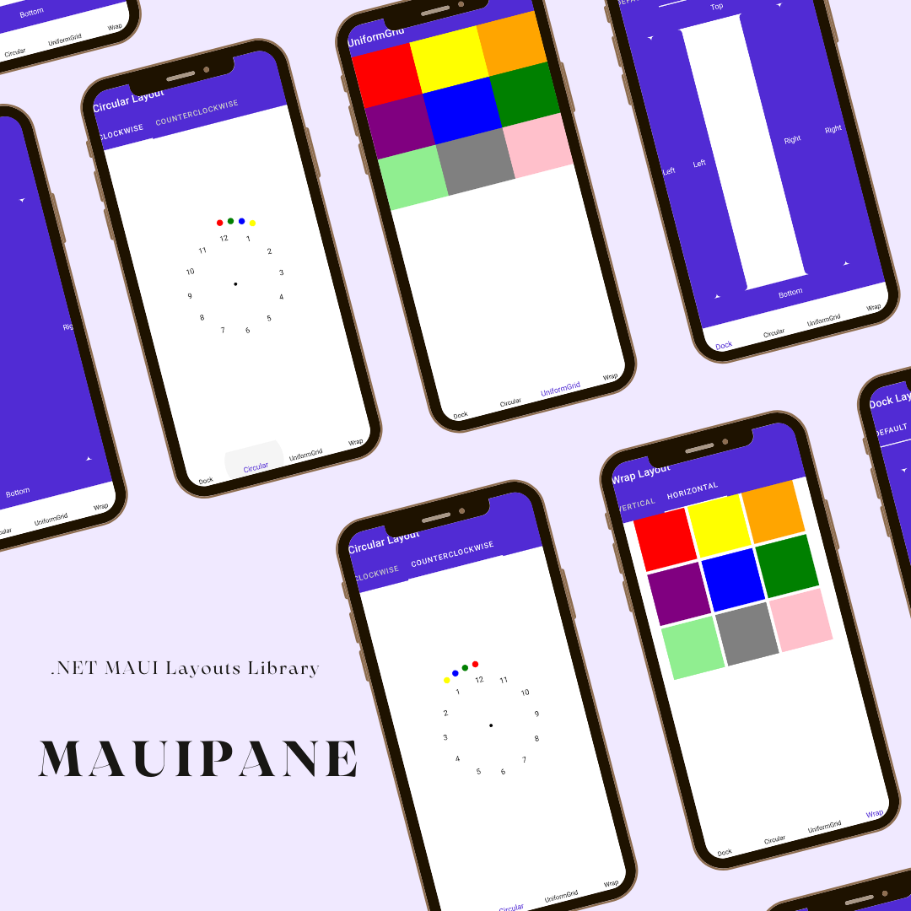
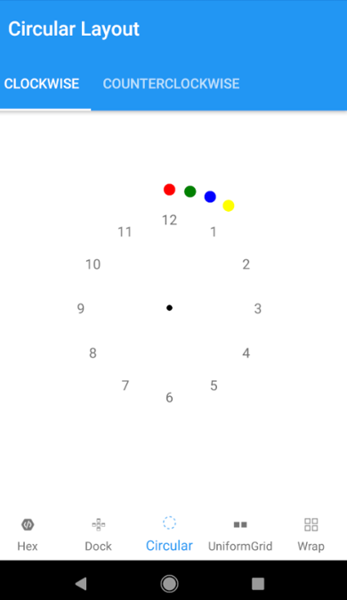
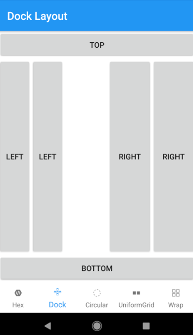
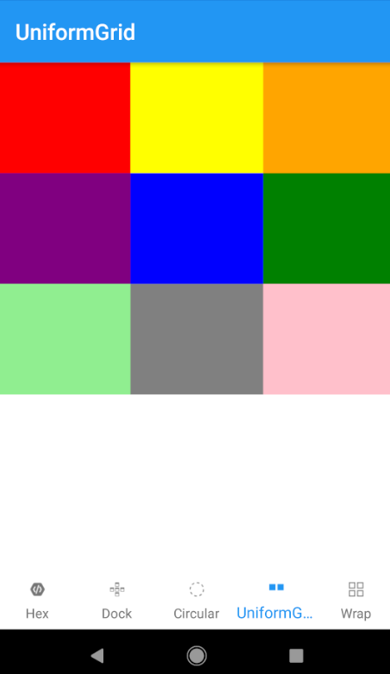
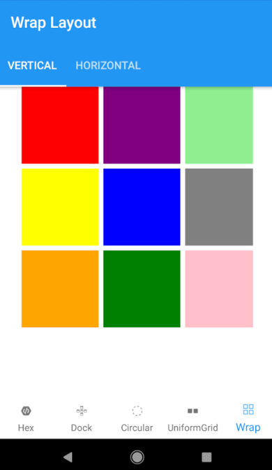

# MauiPane

.NET MAUI **Layouts** Library.



_NOTE: This library is a port of [XamPane](https://github.com/jsuarezruiz/Xampane)._

### CircularLayout

The CircularLayout is a simple Panel derivative that lays out its children in a **circular** arrangement. It has some useful properties to allow some customization like the Orientation (Clockwise or Counterclockwise).

```
<mauipane:CircularLayout
    Orientation="Clockwise">
    <BoxView Color="Black" CornerRadius="6" WidthRequest="6" HeightRequest="6" />       
    <BoxView Color="Red" CornerRadius="12" WidthRequest="12" HeightRequest="12" mauipane:CircularLayout.Angle="0" mauipane:CircularLayout.Radius="120" />
    <BoxView Color="Green" CornerRadius="12" WidthRequest="12" HeightRequest="12" mauipane:CircularLayout.Angle="10" mauipane:CircularLayout.Radius="120" />
    <BoxView Color="Blue" CornerRadius="12" WidthRequest="12" HeightRequest="12" mauipane:CircularLayout.Angle="20" mauipane:CircularLayout.Radius="120" />
    <BoxView Color="Yellow" CornerRadius="12" WidthRequest="12" HeightRequest="12" mauipane:CircularLayout.Angle="30" mauipane:CircularLayout.Radius="120" />
    <Label Text="1" mauipane:CircularLayout.Angle="30" mauipane:CircularLayout.Radius="90" />
    <Label Text="2" mauipane:CircularLayout.Angle="60" mauipane:CircularLayout.Radius="90" />
    <Label Text="3" mauipane:CircularLayout.Angle="90" mauipane:CircularLayout.Radius="90" />
    <Label Text="4" mauipane:CircularLayout.Angle="120" mauipane:CircularLayout.Radius="90" />
    <Label Text="5" mauipane:CircularLayout.Angle="150" mauipane:CircularLayout.Radius="90" />
    <Label Text="6" mauipane:CircularLayout.Angle="180" mauipane:CircularLayout.Radius="90" />
    <Label Text="7" mauipane:CircularLayout.Angle="210" mauipane:CircularLayout.Radius="90" />
    <Label Text="8" mauipane:CircularLayout.Angle="240" mauipane:CircularLayout.Radius="90" />
    <Label Text="9" mauipane:CircularLayout.Angle="270" mauipane:CircularLayout.Radius="90" />
    <Label Text="10" mauipane:CircularLayout.Angle="300" mauipane:CircularLayout.Radius="90" />
    <Label Text="11" mauipane:CircularLayout.Angle="330" mauipane:CircularLayout.Radius="90" />
    <Label Text="12" mauipane:CircularLayout.Angle="360" mauipane:CircularLayout.Radius="90" />
</mauipane:CircularLayout>
```


### DockLayout

The DockLayout allows you to **dock** the child controls to the top, bottom, left or right. By default, the last control, if not given a specific dock position, will fill the remaining space. You can achieve the same with the Grid panel, but for the simpler situations, the DockLayout will be easier to use. Use the DockLayout whenever you need to dock one or several controls to one of the sides, like for dividing up the screen into specific areas.

```
<mauipane:DockLayout
    LastChildFill="False">
    <Button mauipane:DockLayout.Dock="Top" Text="Top" HeightRequest="50"/>
    <Button mauipane:DockLayout.Dock="Bottom" Text="Bottom" HeightRequest="50"/>
    <Button mauipane:DockLayout.Dock="Left" Text="Left" WidthRequest="60"/>
    <Button mauipane:DockLayout.Dock="Left" Text="Left" WidthRequest="60"/>
    <Button mauipane:DockLayout.Dock="Right" Text="Right" WidthRequest="80"/>
    <Button mauipane:DockLayout.Dock="Right" Text="Right" WidthRequest="80"/>
</mauipane:DockLayout>
```


### UniformGrid

The UniformGrid is just like the Grid, with the possibility of multiple rows and columns, but with one important difference: All rows and columns will have the **same size**. Use this when you need the Grid behavior without the need to specify different sizes for the rows and columns.

```
<mauipane:UniformGrid>
    <BoxView Color="Red" />
    <BoxView Color="Yellow" />
    <BoxView Color="Orange" />
    <BoxView Color="Purple" />
    <BoxView Color="Blue" />
    <BoxView Color="Green" />
    <BoxView Color="LightGreen" />
    <BoxView Color="Gray" />
    <BoxView Color="Pink" />
</mauipane:UniformGrid>
```


### WrapLayout

The WrapLayout will position each of its child controls next to the other, horizontally (default) or vertically, until there is no more room, where it will **wrap** to the next line and then continue. Use it when you want a vertical or horizontal collection controls that automatically wraps when there's no more room.

```
<mauipane:WrapLayout 
    Orientation="Vertical"
    Spacing="6"
    HorizontalOptions="Center">
    <BoxView Color="Red" />
    <BoxView Color="Yellow" />
    <BoxView Color="Orange" />
    <BoxView Color="Purple" />
    <BoxView Color="Blue" />
    <BoxView Color="Green" />
    <BoxView Color="LightGreen" />
    <BoxView Color="Gray" />
    <BoxView Color="Pink" />
</mauipane:WrapLayout>
```


## Feedback

Please use [GitHub issues](https://github.com/jsuarezruiz/mauipane/issues) for questions or comments.

## Copyright and license

The library icon is from [Kendis Lasman]( https://www.flaticon.com/authors/kendis-lasman).

Code released under the [MIT license](https://opensource.org/licenses/MIT).